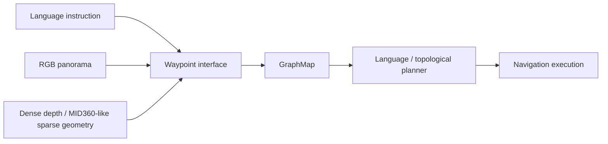
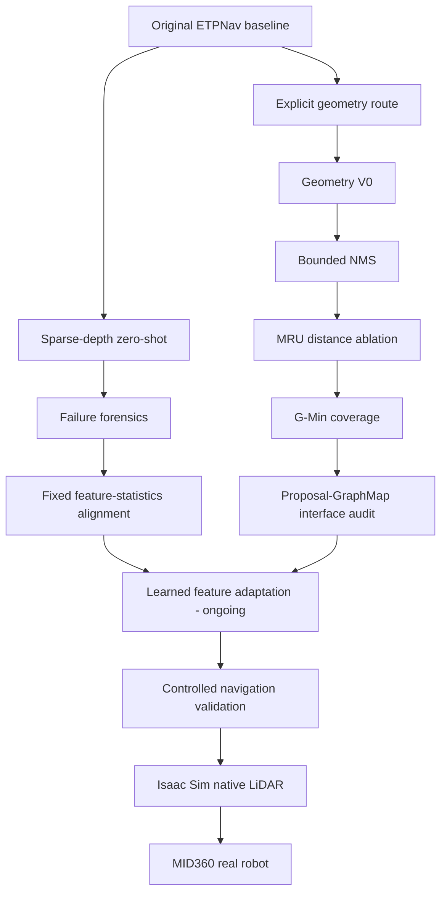

# ETPNav-MID360 Showcase

**Adapting Vision-and-Language Navigation from dense RGB-D perception to sparse LiDAR geometry.**

A public, publication-safe overview of ongoing research on adapting **ETPNav** to **Livox MID360-style sparse LiDAR observations** for Vision-and-Language Navigation (VLN).

> **Status:** research in progress. Active implementation, training code, checkpoints, detailed held-out protocols, and unpublished results remain in a private research repository.

[Application summary](docs/APPLICATION_SUMMARY.md) · [Detailed research overview](docs/RESEARCH_OVERVIEW.md) · [Original ETPNav](https://github.com/MarSaKi/ETPNav) · [Paper](https://arxiv.org/abs/2304.03047)

---

## At a Glance

| | |
|---|---|
| **Research question** | Can an RGB-D-based VLN system retain its learned navigation prior when dense depth is replaced by sparse LiDAR observations? |
| **Base system** | ETPNav / Habitat / R2R-CE |
| **Sensor target** | Livox MID360-style sparse geometry |
| **Main interface** | Waypoint proposal / feature adaptation |
| **Downstream constraint** | Keep GraphMap and language/topological planning frozen whenever possible |
| **Current stage** | Learned sparse-to-dense feature adaptation |
| **Target transfer** | Habitat → Isaac Sim → MID360 real robot |

---

## System Boundary

The project deliberately isolates the **waypoint interface** instead of redesigning the entire navigation stack.



This makes it possible to ask whether a failure comes from **sensor sparsity**, **proposal semantics**, **feature-domain shift**, or **downstream graph interaction** without changing every component at once.

---

## My Contributions

- Reproduced and instrumented an ETPNav / Habitat VLN baseline on Matterport3D-based R2R-CE experiments.
- Built deterministic MID360-like sparse-depth abstractions for controlled simulation studies.
- Designed and evaluated multiple explicit-geometry waypoint proposal variants.
- Audited how raw waypoint diversity changes after GraphMap association.
- Traced sparse-depth failures through intermediate activations of the frozen waypoint predictor.
- Tested a fixed feature-statistics alignment hypothesis and documented the negative result.
- Separated static mechanism tests from navigation evaluation to keep experimental conclusions interpretable.
- Began investigating learned sparse-to-dense feature adaptation while keeping the original downstream waypoint predictor frozen.

---

## Research Progression



The project has intentionally preserved negative results because several of them changed the research direction.

---

## Selected Controlled Results

The same fixed 20-episode `val_unseen` **development panel** is used below for rapid controlled comparison. These are **not official benchmark claims**.

| Method | SR ↑ | SPL ↑ | NE ↓ | OS ↑ | nDTW ↑ | SDTW ↑ |
|---|---:|---:|---:|---:|---:|---:|
| Original ETPNav | **0.800** | **0.698** | **2.922** | **0.800** | **0.714** | **0.651** |
| Geometry V0 | 0.500 | 0.321 | 5.055 | 0.500 | 0.448 | 0.305 |
| Geometry + bounded NMS | 0.550 | 0.364 | 4.526 | 0.600 | 0.467 | 0.356 |
| MRU | 0.450 | 0.365 | 4.730 | 0.550 | 0.534 | 0.351 |
| G-Min | 0.500 | 0.428 | 4.274 | 0.650 | 0.582 | 0.399 |
| Sparse depth zero-shot | 0.000 | 0.000 | 9.108 | 0.000 | 0.281 | 0.000 |

### What these experiments established

**1. Matching waypoint distance is not enough.**  
MRU shifted candidate distances back toward an intermediate range, but navigation did not recover.

**2. Raw proposal diversity is not Graph action diversity.**  
Geometrically distinct short-range candidates can be absorbed into visited graph nodes and never become distinct topological actions.

**3. Sparse-depth zero-shot failure is not simply an encoder failure.**  
Activation tracing showed that partial structure remains after the depth encoder; complete collapse occurs later inside the frozen waypoint predictor.

**4. Simple feature-statistics alignment is insufficient.**  
Channel-wise mean/std alignment did not restore downstream predictor activity or waypoint diversity on held-out static observations.

These findings motivate the current learned-adaptation direction.

---

## Current Direction

Only the publication-safe system boundary is disclosed publicly:

```text
Sparse geometry
→ frozen depth representation
→ lightweight learned adaptation
→ frozen original waypoint predictor
→ GraphMap / planner
```

The current study asks whether adaptation can recover:

1. compatibility with the dense feature domain;
2. non-collapsed predictor activity;
3. angular and radial waypoint diversity;
4. navigation performance under controlled evaluation.

Exact architecture choices, training recipes, held-out protocols, checkpoints, and current unpublished results remain private while the work is ongoing.

---

## Experimental Principles

- Change one hypothesis-bearing component at a time.
- Keep original downstream modules frozen unless the experiment explicitly studies them.
- Separate static mechanism tests from navigation evaluation.
- Use fixed development episodes for controlled ablations.
- Do not present development-panel numbers as official benchmark results.
- Preserve negative results when they affect the next research decision.
- Avoid adapting evaluation conditions after observing held-out outcomes.

A fuller technical account is available in [`docs/RESEARCH_OVERVIEW.md`](docs/RESEARCH_OVERVIEW.md).

---

## Roadmap

```text
Habitat / R2R-CE controlled experiments
        ↓
full validation after mechanism checks
        ↓
Isaac Sim native LiDAR simulation
        ↓
MID360 + IMU localization / FAST-LIO2
        ↓
real MID360 + camera robot platform
        ↓
VLN high-level waypoint decisions
        ↓
Nav2 / MPPI execution and safety
```

Long-term responsibility split:

- **VLN:** high-level semantic/topological decisions;
- **LiDAR + localization:** geometry and pose estimation;
- **Nav2 / MPPI:** local tracking, obstacle avoidance, and execution safety.

---

## Repository Scope

This is a **showcase repository**, not the active development repository. It intentionally does **not** redistribute:

- Matterport3D scenes or restricted datasets;
- pretrained model checkpoints;
- training caches or experimental artifacts;
- current unpublished implementation details;
- private collaboration discussions, pull requests, or issue threads.

---

## Upstream Project

This work builds on:

**ETPNav: Evolving Topological Planning for Vision-Language Navigation in Continuous Environments**  
Dong An, Hanqing Wang, Wenguan Wang, Zun Wang, Yan Huang, Keji He, Liang Wang  
*IEEE Transactions on Pattern Analysis and Machine Intelligence*, 2024

- Original repository: https://github.com/MarSaKi/ETPNav
- Paper: https://arxiv.org/abs/2304.03047

Please cite the original ETPNav paper when using the upstream method or implementation.

```bibtex
@article{an2024etpnav,
  title={ETPNav: Evolving Topological Planning for Vision-Language Navigation in Continuous Environments},
  author={An, Dong and Wang, Hanqing and Wang, Wenguan and Wang, Zun and Huang, Yan and He, Keji and Wang, Liang},
  journal={IEEE Transactions on Pattern Analysis and Machine Intelligence},
  year={2024}
}
```
