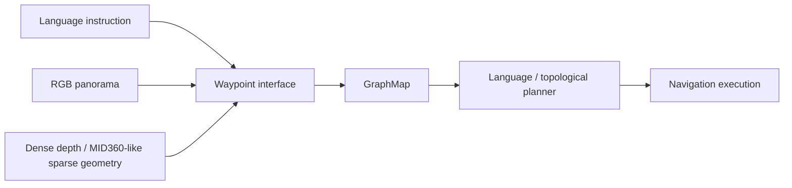

# ETPNav-MID360 Showcase

**Adapting Vision-and-Language Navigation from dense RGB-D perception to sparse LiDAR geometry.**

This repository is a public research overview of ongoing work on adapting **ETPNav** to **Livox MID360-style sparse LiDAR observations** for Vision-and-Language Navigation (VLN).

> **Status:** research in progress. The active implementation, training code, checkpoints, detailed experimental protocols, and unpublished results are maintained in a private research repository while the study is ongoing.

---

## Research Question

ETPNav was designed around dense RGB-D observations. This project asks:

> **Can an RGB-D-based VLN system retain its learned navigation prior when dense depth is replaced by sparse LiDAR observations?**

The goal is not to rebuild the whole navigation stack. Instead, the work isolates the **waypoint interface** and keeps as much of the downstream ETPNav pipeline unchanged as possible.



---

## Motivation

Dense RGB-D and sparse LiDAR provide very different geometric observations. A waypoint predictor trained on dense depth may fail even when the sparse LiDAR still contains useful geometry.

This creates a clean research boundary:

```text
sensor-domain shift
        ↓
waypoint proposal
        ↓
GraphMap / planner / execution
```

By changing one interface at a time, the experiments can distinguish failures caused by sensor sparsity, waypoint semantics, feature-domain mismatch, or downstream graph interaction.

---

## My Contributions

The work so far includes:

- reproducing and instrumenting an ETPNav / Habitat VLN baseline on Matterport3D-based R2R-CE experiments;
- building MID360-like sparse-depth abstractions for controlled simulation studies;
- designing and evaluating multiple explicit-geometry waypoint proposal variants;
- auditing the interaction between raw waypoint diversity and GraphMap action diversity;
- tracing sparse-depth failures through the frozen waypoint predictor at the activation level;
- testing a fixed feature-statistics alignment hypothesis and documenting the negative result;
- separating static mechanism tests from navigation evaluation to avoid changing multiple components at once;
- investigating learned sparse-to-dense feature adaptation while keeping the original downstream waypoint predictor frozen.

---

## Selected Controlled Results

The table below uses the same fixed 20-episode `val_unseen` **development panel** for controlled comparison. These numbers are **not claimed as official benchmark results**.

| Method | SR ↑ | SPL ↑ | NE ↓ | OS ↑ | nDTW ↑ | SDTW ↑ |
|---|---:|---:|---:|---:|---:|---:|
| Original ETPNav | **0.800** | **0.698** | **2.922** | **0.800** | **0.714** | **0.651** |
| Geometry V0 | 0.500 | 0.321 | 5.055 | 0.500 | 0.448 | 0.305 |
| Geometry + bounded NMS | 0.550 | 0.364 | 4.526 | 0.600 | 0.467 | 0.356 |
| MRU | 0.450 | 0.365 | 4.730 | 0.550 | 0.534 | 0.351 |
| G-Min | 0.500 | 0.428 | 4.274 | 0.650 | 0.582 | 0.399 |
| Sparse depth zero-shot | 0.000 | 0.000 | 9.108 | 0.000 | 0.281 | 0.000 |

The purpose of this panel is hypothesis testing, not leaderboard reporting.

---

## Research Progression

### 1. Explicit geometry route

The first approach replaced the learned waypoint proposal with geometric candidates reconstructed from depth and then sparsified into a MID360-like representation.

```text
Depth panorama
→ metric point cloud
→ MID360-like filtering
→ local geometry
→ explicit waypoint proposal
→ frozen GraphMap / planner
```

Variants included:

- **Geometry V0:** simple traversability with long-range preference;
- **bounded NMS:** angle remains circular while radial distance remains bounded;
- **MRU:** tests whether restoring a middle-distance waypoint distribution is sufficient;
- **G-Min:** removes a single preferred radius and emphasizes angular/radial coverage.

### 2. What the geometry experiments showed

A key negative result was that fixing waypoint distance distribution alone did not recover navigation performance.

Another important observation was:

> **Raw proposal diversity is not the same as GraphMap action diversity.**

Geometrically distinct short-range candidates can be absorbed into already visited graph nodes and therefore never become distinct topological actions.

This suggests that the waypoint front-end and GraphMap interface are coupled more strongly than candidate-count statistics alone imply.

### 3. Sparse-depth zero-shot test

The next experiment kept the original learned ETPNav waypoint predictor and replaced dense depth with deterministic MID360-like sparse depth.

```text
Dense depth
→ metric reconstruction
→ MID360-like angular sparsification
→ nearest-return projection
→ sparse depth
→ frozen original waypoint predictor
```

The result was a complete navigation failure on the development panel, with waypoint distance collapsing to a fixed short-range pattern.

### 4. Failure forensics

Rather than immediately retraining the model, intermediate activations were traced through the frozen predictor.

Sparse observations retained partial structure after the depth encoder, but the predictor later entered a regime where the classifier activation collapsed to zero and the output became effectively bias-driven.

This changed the working hypothesis from:

> “Sparse LiDAR destroys all useful depth features.”

into:

> “Sparse features leave the learned predictor's operating distribution before the final waypoint decision.”

### 5. Fixed feature alignment

A channel-wise mean/std feature alignment experiment tested whether simple first/second-order statistics were enough to bring sparse features back toward the dense feature domain.

They were not: downstream classifier activity and waypoint diversity remained collapsed on held-out static observations.

This negative result motivated the current direction: **learned nonlinear feature adaptation** rather than hand-designed statistical alignment.

---

## Current Direction

The active research direction is intentionally described only at a high level here:

```text
Sparse geometry
→ frozen depth representation
→ lightweight learned adaptation
→ frozen original waypoint predictor
→ GraphMap / planner
```

The current study asks whether feature-domain adaptation can recover:

1. compatibility with the dense feature domain;
2. non-collapsed predictor activity;
3. angular and radial waypoint diversity;
4. navigation performance under controlled evaluation.

Detailed implementation, training recipes, held-out protocols, and unpublished results remain private while the study is ongoing.

---

## Roadmap

```text
Habitat / R2R-CE controlled experiments
        ↓
full validation after mechanism checks
        ↓
Isaac Sim native LiDAR simulation
        ↓
MID360 + IMU localization / FAST-LIO2
        ↓
real MID360 + camera robot platform
        ↓
VLN high-level waypoint decisions
        ↓
Nav2 / MPPI execution and safety
```

The long-term system boundary is:

- **VLN:** high-level semantic/topological decisions;
- **LiDAR + localization:** geometry and pose estimation;
- **Nav2 / MPPI:** local tracking, obstacle avoidance, and execution safety.

---

## Repository Scope

This is a **showcase repository**, not the full development repository.

It intentionally does **not** redistribute:

- Matterport3D scenes or restricted datasets;
- pretrained model checkpoints;
- training caches or experimental artifacts;
- current unpublished implementation details;
- private collaboration discussions, pull requests, or issue threads.

A more detailed but still publication-safe project summary is available in [`docs/RESEARCH_OVERVIEW.md`](docs/RESEARCH_OVERVIEW.md).

---

## Upstream Project

This work builds on:

**ETPNav: Evolving Topological Planning for Vision-Language Navigation in Continuous Environments**  
Dong An, Hanqing Wang, Wenguan Wang, Zun Wang, Yan Huang, Keji He, Liang Wang  
*IEEE Transactions on Pattern Analysis and Machine Intelligence*, 2024

- Original repository: https://github.com/MarSaKi/ETPNav
- Paper: https://arxiv.org/abs/2304.03047

Please cite the original ETPNav paper when using the upstream method or implementation.

```bibtex
@article{an2024etpnav,
  title={ETPNav: Evolving Topological Planning for Vision-Language Navigation in Continuous Environments},
  author={An, Dong and Wang, Hanqing and Wang, Wenguan and Wang, Zun and Huang, Yan and He, Keji and Wang, Liang},
  journal={IEEE Transactions on Pattern Analysis and Machine Intelligence},
  year={2024}
}
```
